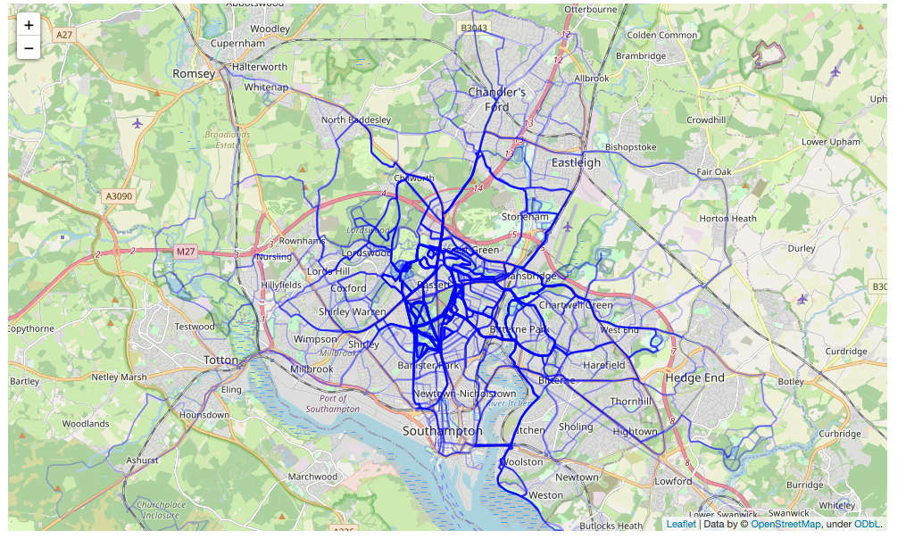
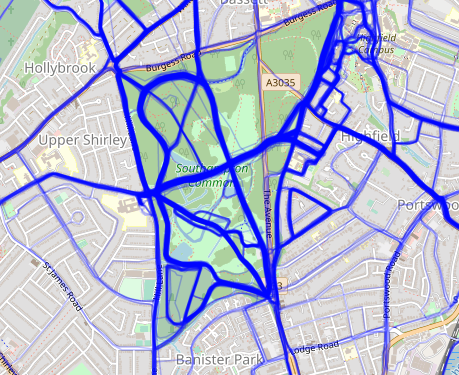
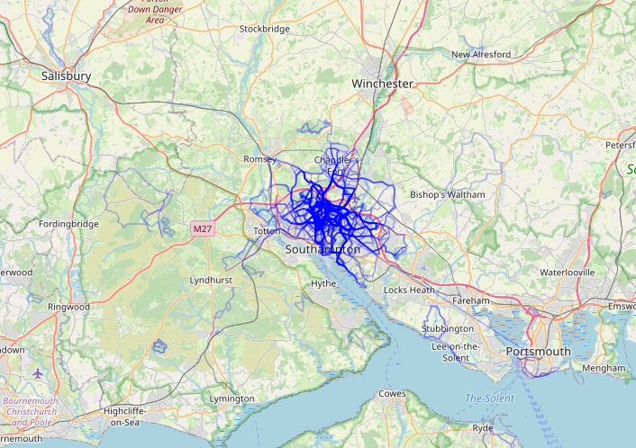
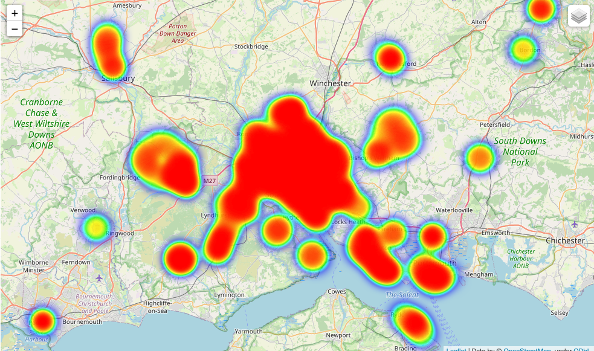

# GPS Mapping: visualising folium maps

By running our folium code (see main notebook), we can produce a fully interactive map.

I include images here to show this functionality.


```python
from IPython.display import Image
```


```python
Image("Images/Soton_med.png", width="1000", height="1000")
```


    

    


Including on smaller scales.


```python
Image("Images/Soton_small.png", width="500", height="500")
```


    

    


And larger ones.


```python
Image("Images/Soton_large.png", width="800", height="800")
```


    

    


Similarly, after implementing the code in the notebook, we can produce a fully interactable heatmap (as captured here in an image.)


```python
Image("Images/Heatmap.png", width="800", height="1000")
```


    

    


